## A) Seção "Análise Manual":

### Projeto code-smells-project
Antes

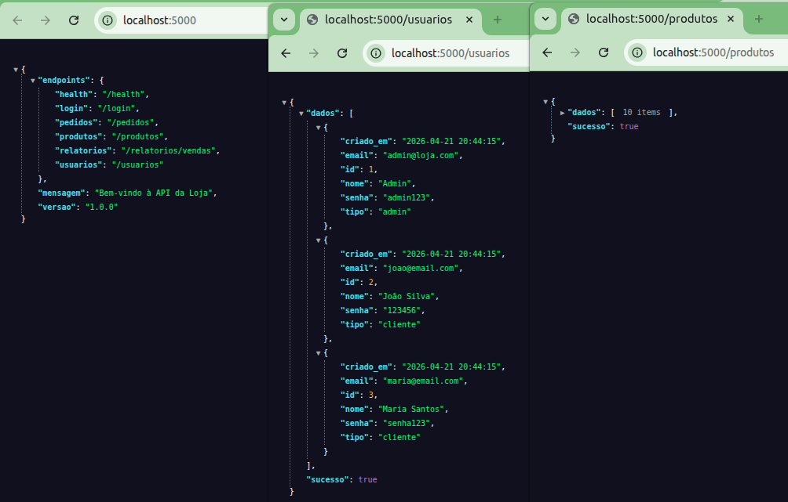
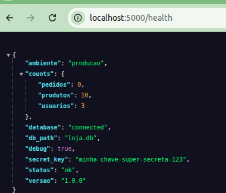  
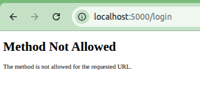

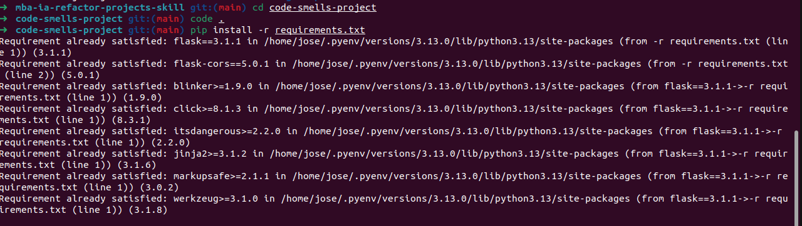

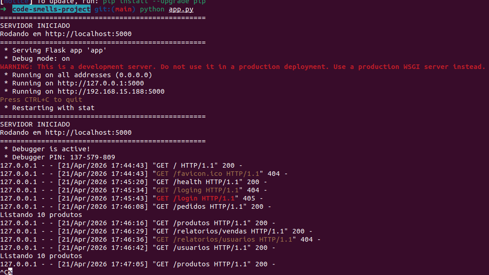

#### code-smells-project: Estrutura do projeto
Antes

```txt
── code-smells-project/  
│   ├── app.py  
│   ├── controllers.py  
│   ├── models.py  
│   ├── database.py  
│   ├── requirements.txt  
│   ├── README.md  
│   ├── loja.db
```

### code-smells-project depois da refatoração


### Projeto ecommerce-api-legacy
Antes  
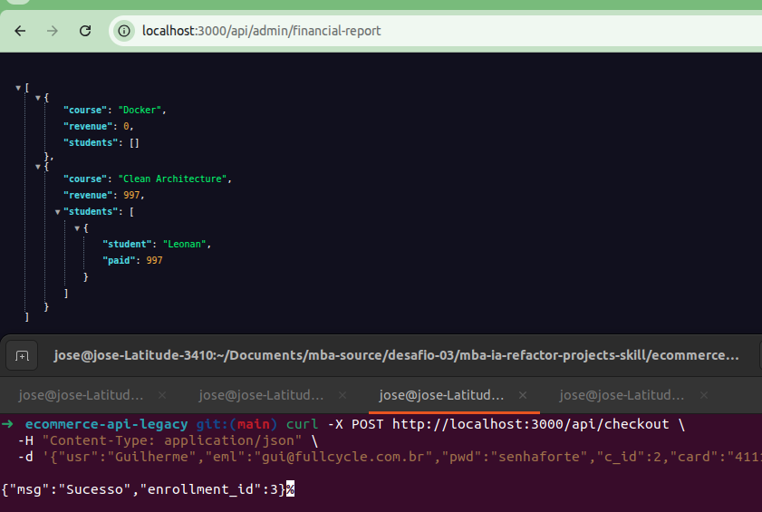  
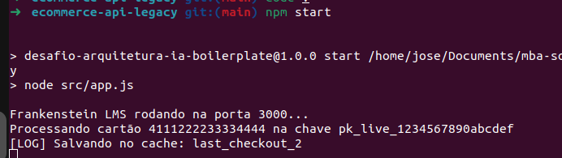  
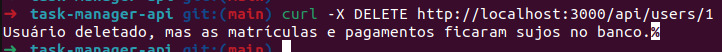

#### ecommerce-api-legacy: Estrutura do projeto

```txt
── ecommerce-api-legacy/  
│   ├── src/  
│   │   ├── app.js  
│   │   ├── AppManager.js  
│   │   ├── utils.js  
│   ├── api.http  
│   ├── package.json  
│   ├── package-lock.json  
│   ├── README.md
```

### ecommerce-api-legacy depois da refatoração

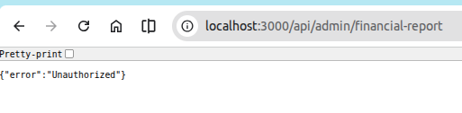  
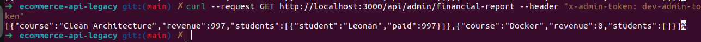


#### Projeto task-manager-api
Antes

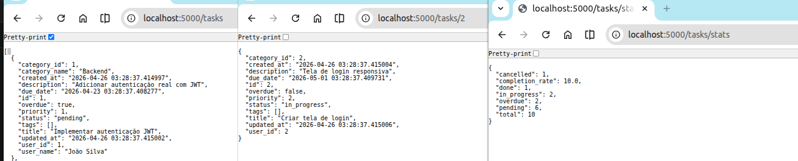  
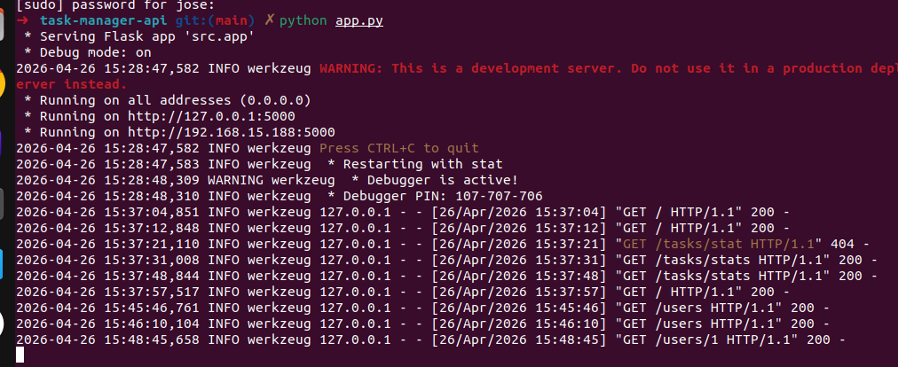

#### task-manager-api: Estrutura do projeto

```txt
── task-manager-api/
│   ├── models/
│   │   ├── __init__.py
│   │   ├── category.py
│   │   ├── task.py
│   │   ├── user.py
│   ├── routes/
│   │   ├── __init__.py
│   │   ├── report_routes.py
│   │   ├── task_routes.py
│   │   ├── user_routes.py
│   ├── services/
│   │   ├── __init__.py
│   │   ├── notification_service.py
│   ├── utils/
│   │   ├── __init__.py
│   │   ├── helpers.py
│   ├── app.py
│   ├── database.py
│   ├── README.md
│   ├── requirements.txt
│   ├── seed.py
```


### task-manager-api depois da refatoração

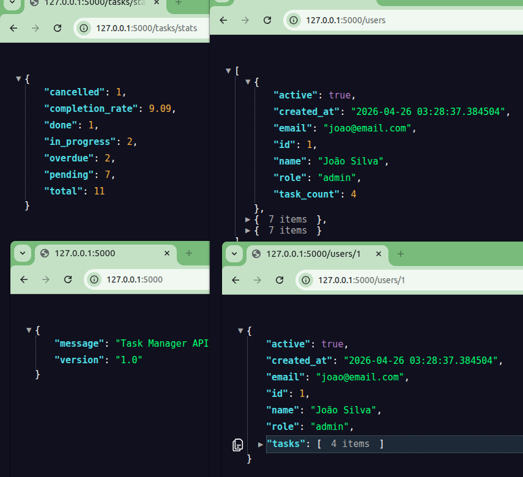  


### Classificação de Problemas

#### Projeto code-smells-project

#### Classificação Alta

* No modulo [models.py](http://models.py) tem varias consultas, qualquer chamada pode injetar SQL arbitrário, permitindo extração de dados, exclusão de dados ou comprometimento total do banco de dados
* Senhas/chaves escritas diretamente no código-fonte. 
* Ainda retornado as credenciais na rota http://localhost:5000/health
* São apagadas dados das tabelas sem nenhuma restrição.
* No [models.py](http://models.py), se abre um novo cursor para cada item achado do usuário, se recomenda criar só uma consulta para pegar o detalhe dos pedidos

#### Classificação média
* Seria bom usar ferramentas de logging no lugar de usar print
* Regras de negócio de criação e atualização de produto espalhada
* As rotas chamam os models diretamente, acoplamento forte.

#### Projeto ecommerce-api-legacy

#### Classificação Alta

* AppManager tem muitas responsabilidades  
* Credentials estão hardcode  
* Criação de senhas não usa um padrão seguro, função badCrypto  
* Em algumas consultas pode ser aplicar Joins para melhorar a performance do processo  
* O cache cresce sempre e não tem TTL  
* As operação de apagar usuários deixa informações inconsistentes no projeto

#### Classificação média  
* Expõe dados sensíveis de cartão dos usuários  
* Dar mais informação dos erros nos logs  
* Regras negócio sem documentar para PAID e DENIED, talvez usar algum arquivo para padronizar o fluxo 

#### Projeto task-manager-api

#### Classificação Alta  
* Tem algumas credenciais declaradas no código  
* Criação da password bem fraca  
* Expõe informaçõe sensíveis do usuário como o password  
* Muita responsabilidade nas rotas  
* O banco pode validar algumas propriedades das tasks em SQL  sem precisar ser feito no código de forma hard para“overdue” e “status”

#### Classificação Baixa  
* Algumas serializações poderia ser usando dict  
* Falta de paginação dependendo do tamanho pode ser necessário.  
* Não explora o banco para aplicar algumas remoções em cascata  
* Algumas classes não são chamadas  
* Falta de alguns padrões de formatação e qualidade de código

## B) Seção "Construção da Skill"

Anti-patterns são abstratos e podem reconhecer qualquer linguagem de programação e tecnologia.

No caso das heurísticas, acho que até daria para deixar por linguagem e tecnologia. Identificar framework, banco de dados precisam ser especializados e para garantir a precisão para detectar casa artefato.

Comecei fazendo em “Github Copilot”,  e comecei a construção olhando primeiro o código dos projetos, e populando as referências. Influencia muito a completude da descrição e objetivo, fui descrevendo as fases de forma independente e ligação das referências como indica a ajuda do github copilot

[https://docs.github.com/en/copilot/how-tos/copilot-on-github/customize-copilot/customize-cloud-agent/add-skills](https://docs.github.com/en/copilot/how-tos/copilot-on-github/customize-copilot/customize-cloud-agent/add-skills)

### Anti-patterns escolhidos

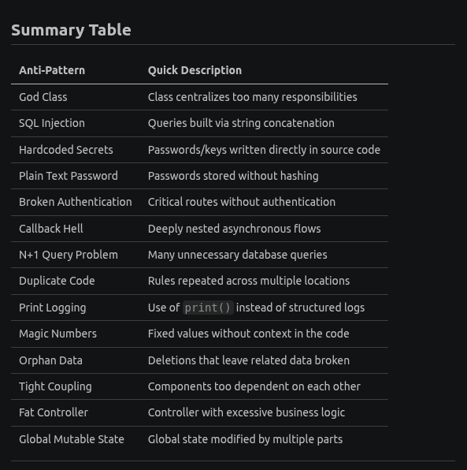

## D) Seção "Como Executar":   

### Github Copilot  
No copilot se adiciona as skill no path  
.github/skills/\<nome-skill\>[SKILL.md](http://SKILL.md)  
para executar só chamar ele no chat

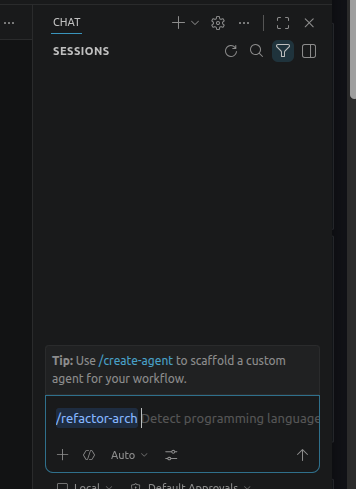

### Claude Code

Execução

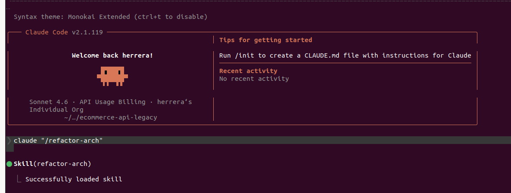  

Uso de créditos no claude code
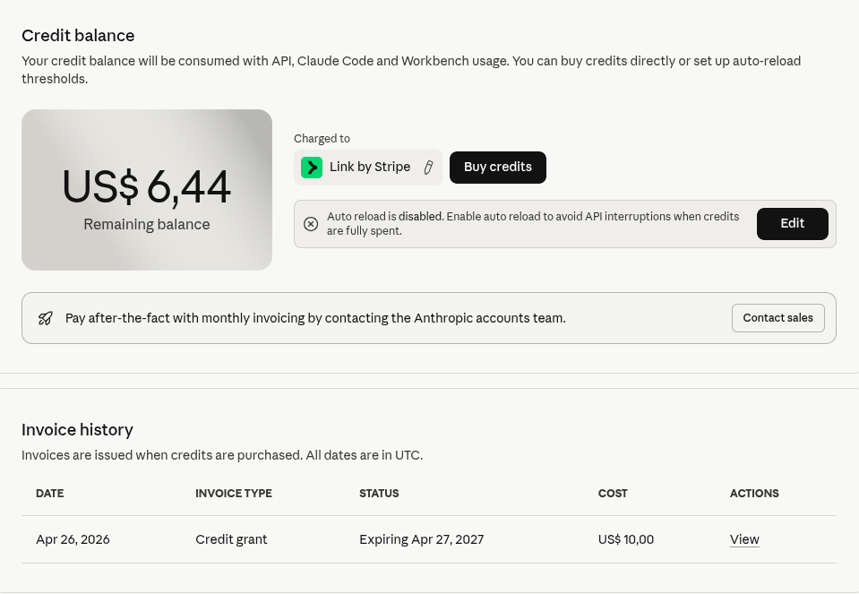  


## E) Execução Phase 3 :   

### code-smells-project

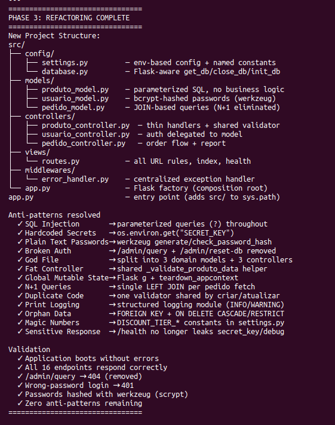

### ecommerce-api-legacy

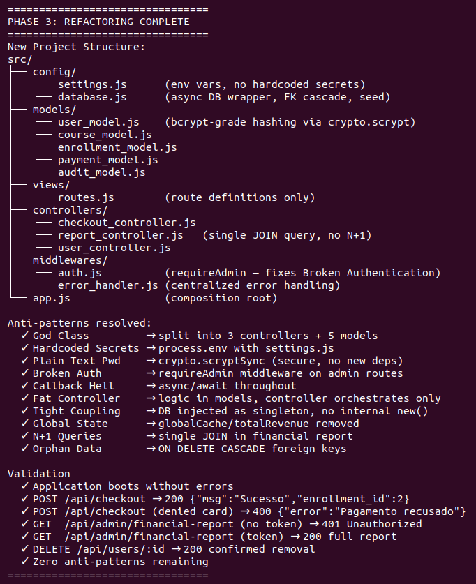

### task-manager-api

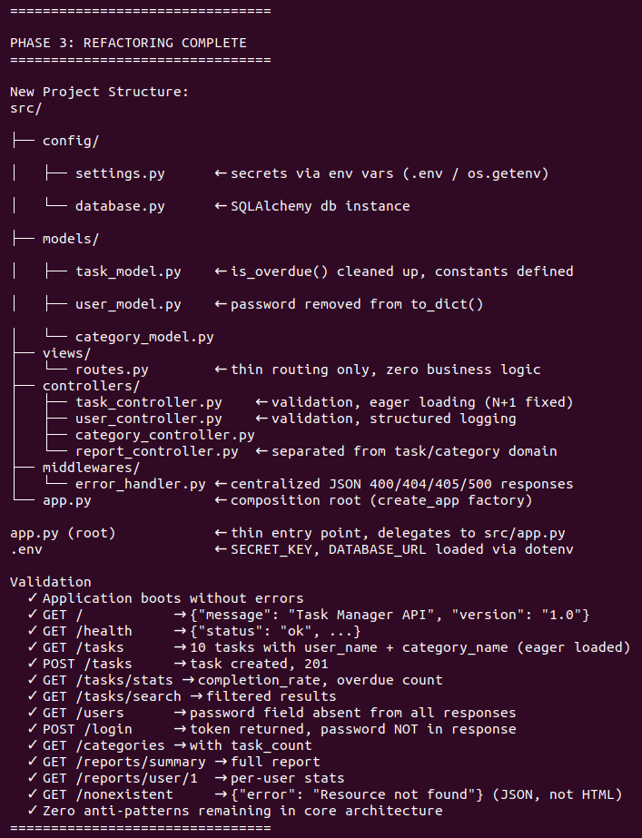